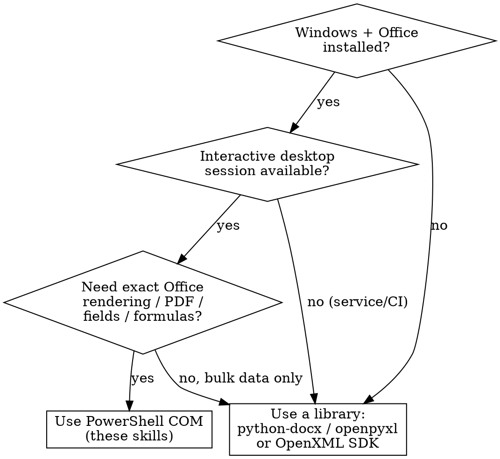

# Office Documents Overview

## Overview

This skill library teaches agents to read and write Microsoft Office files on
Windows by driving the installed Office applications through **PowerShell COM
automation** (`New-Object -ComObject Word.Application` /
`Excel.Application`).

**Core principle:** COM automation makes the real Office app do the work, so
formatting, fields, formulas, and rendering match exactly what a user sees. The
trade-off is that it only works on Windows with Office installed, and COM
objects must be released carefully or orphaned `WINWORD.EXE` / `EXCEL.EXE`
processes pile up.

## When to Use

Use these skills when you need to:
- Extract text/tables from `.docx` or values/ranges from `.xlsx`
- Generate or fill report templates, mail-merge style documents, invoices
- Find-and-replace, edit paragraphs, insert tables/images in Word
- Read/write cells, formulas, multiple sheets in Excel
- Convert Office files to PDF using the real Office engine

**Routing:**

| Task | Skill |
|------|-------|
| Anything with Word `.docx` / `.doc` | `office-docs:word-com-powershell` |
| Anything with Excel `.xlsx` / `.xls` / `.csv` | `office-docs:excel-com-powershell` |
| Process won't close, file locked, GC of COM refs | `office-docs:office-com-cleanup` |

## Decide: COM vs library-based



**Prefer COM when:** you need Office's own rendering, recalculated formulas,
PDF export, complex formatting, or the file is a `.doc`/`.xls` legacy format.

**Prefer a library when:** running headless/CI/service accounts (Excel COM is
unreliable in Session 0), high-volume batch processing, or Office is not
installed. See `references/non-com-alternatives.md`.

## Hard Requirements for COM

1. **Windows only**, with the matching Office app installed.
2. **Interactive session** — COM automation of Office under a non-interactive
   service account (Session 0) is unsupported by Microsoft and fails in
   subtle ways, especially Excel.
3. **Always release COM objects** and quit the app, even on error. This is the
   #1 cause of bugs. See `office-docs:office-com-cleanup`.
4. **Use absolute paths.** Office resolves relative paths against its own
   working directory (often the Documents folder), not the shell's CWD.

## Universal Safety Pattern

Every COM script must follow this shape:

```powershell
$ErrorActionPreference = 'Stop'
$app = $null
try {
    $app = New-Object -ComObject Word.Application   # or Excel.Application
    $app.Visible = $false
    $app.DisplayAlerts = $false
    # ... do work, using ABSOLUTE paths ...
}
finally {
    if ($app) { $app.Quit() }
    # Release every COM reference you held, then force GC.
    # See office-docs:office-com-cleanup for the full release helper.
}
```

## Common Mistakes

- **Relative paths** → Office saves the file somewhere unexpected. Always
  `Resolve-Path` / `[System.IO.Path]::GetFullPath()` first.
- **Forgetting `DisplayAlerts = $false`** → script hangs on a modal "Save
  changes?" dialog with no visible window.
- **Not releasing COM objects** → orphaned `WINWORD.EXE`/`EXCEL.EXE`, locked
  files, memory growth. Read `office-docs:office-com-cleanup`.
- **Running in CI / as a service** → use a library instead (see alternatives).
- **Assuming 0-based indexes** → Office COM collections are **1-based**.
